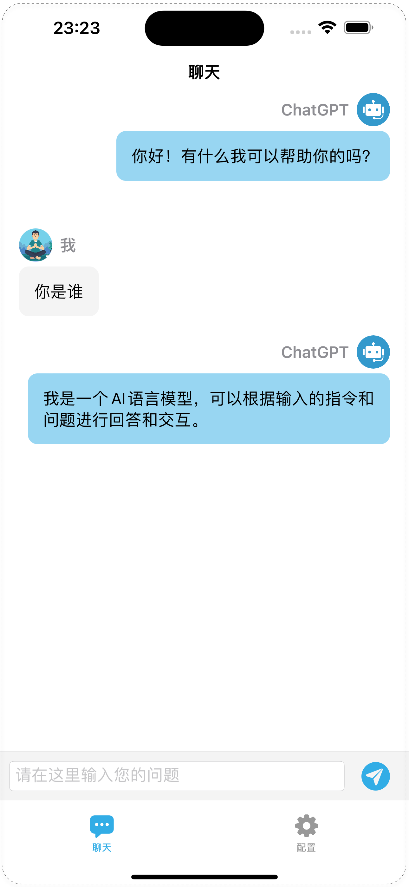
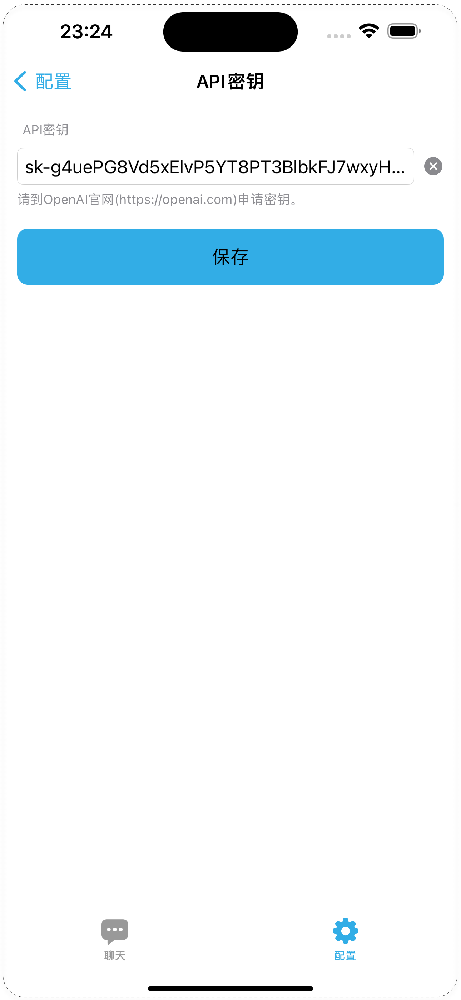

# LinkChat - ChatGPT聊天APP

## 简介

LinkChat 是一款使用 SwiftUI 开发的ChatGPT智能聊天 App。

- 1、可配置自己的OpenAPI密钥。

- 2、聊天消息已实现打字效果。

- 3、长按聊天记录可复制文本。

- 4、无需梯子，移动网络下即可使用。

  

> 本项目是本人学习SwiftUI的练手项目，同时也是为了自己方便在手机上使用ChatGPT聊天功能。
> 网络请求的部分代码参考了 [ChatGPTSwiftUI](https://github.com/alfianlosari/ChatGPTSwiftUI.git)这个开源项目，向大神致敬！

## 编译

- 最低 iOS 16.0

**运行方法：**
打开项目即可编译，无需安装其它依赖库。

> 本项目未使用第三方框架，所以有一些功能实现简单，仅供参考。

## 效果示例

### TODO

1. [x] 聊天记录持久化
2. [x] 新建聊天窗口功能
3. [x] 记录聊天上下文功能
3. [x] 增加更多聊天配置

### FAQ

* [New Issue](https://github.com/xuebusi/LinkChat/issues)

### License

LinkChat is released under the MIT license. [See LICENSE](https://github.com/xuebusi/LinkChat/blob/main/LICENSE) for details.
